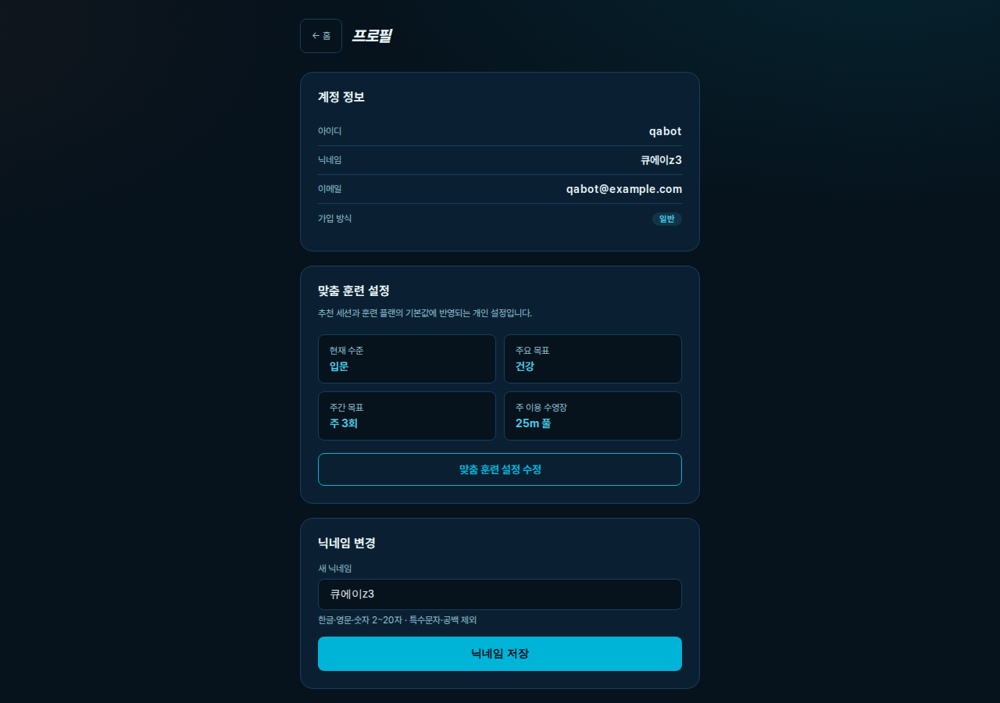
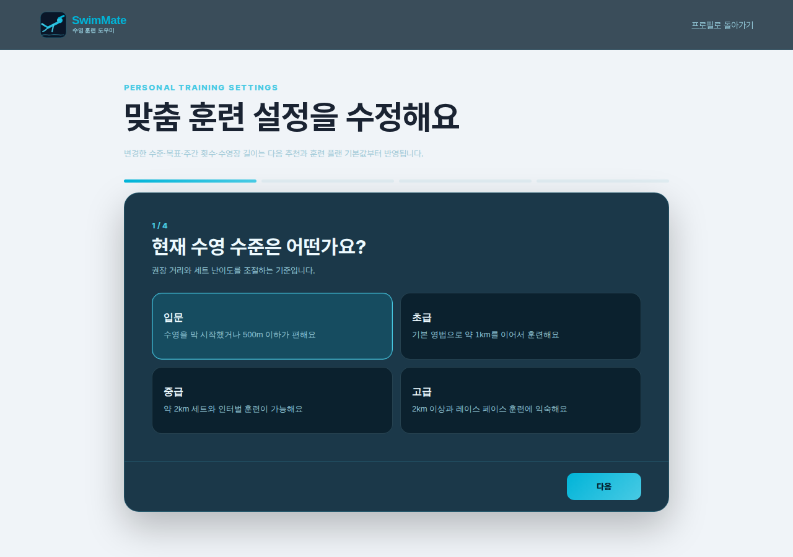
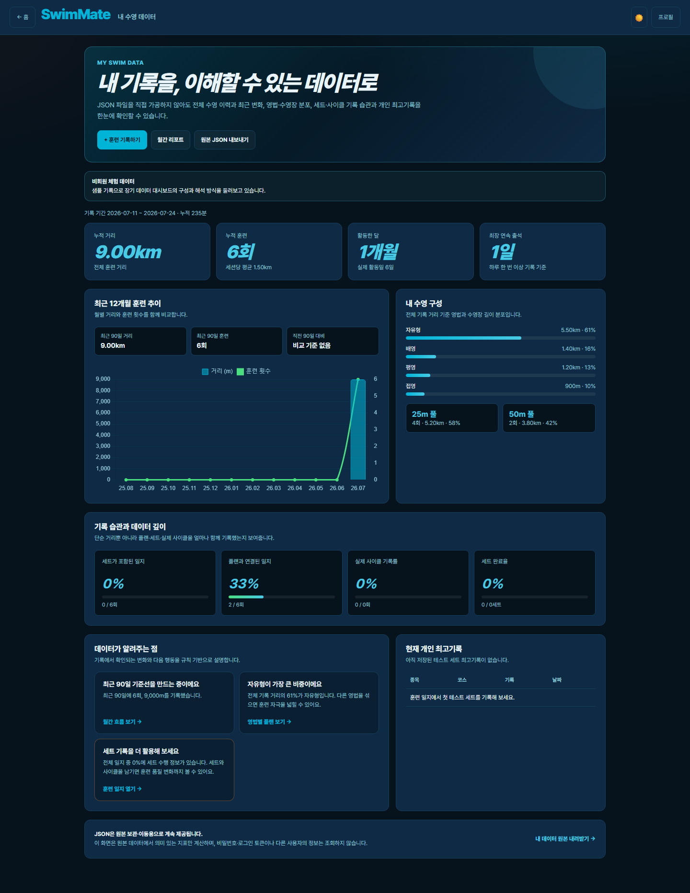
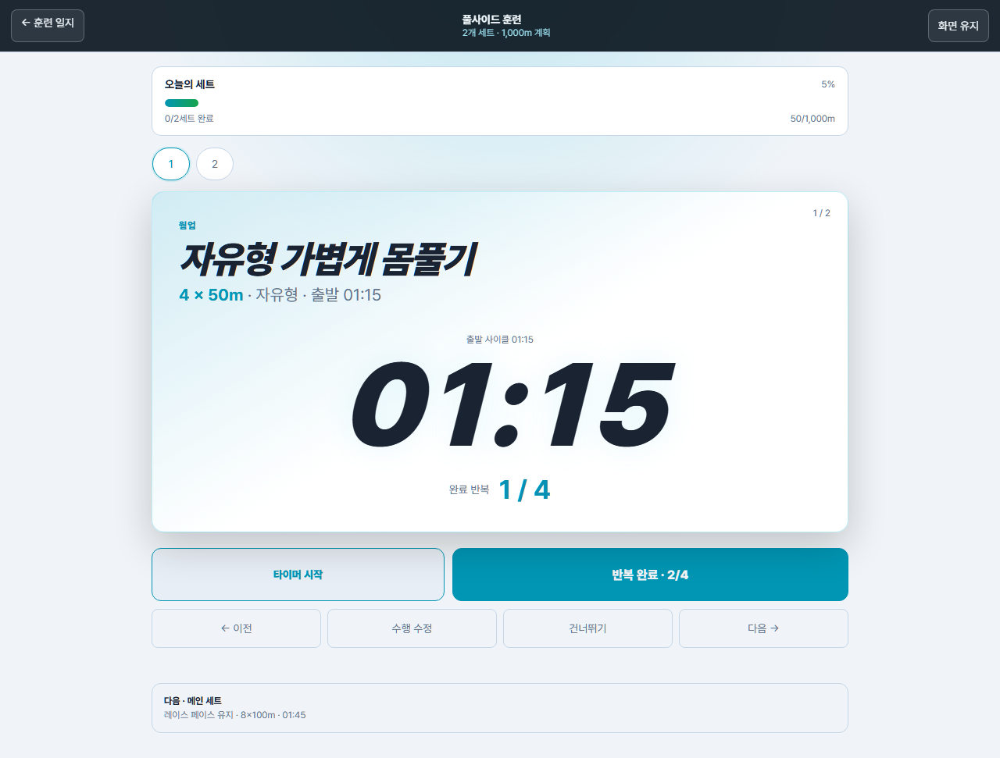
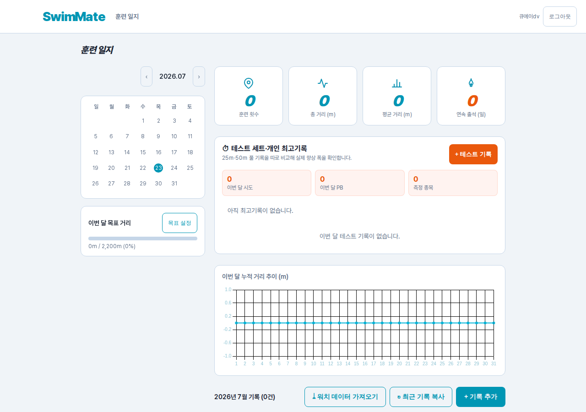
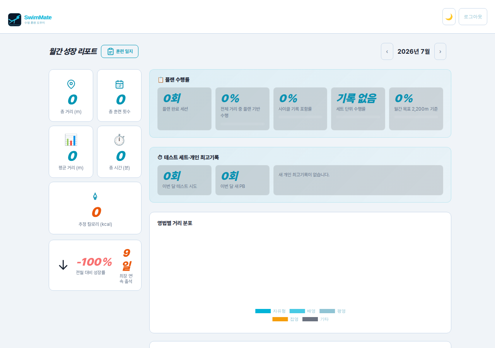
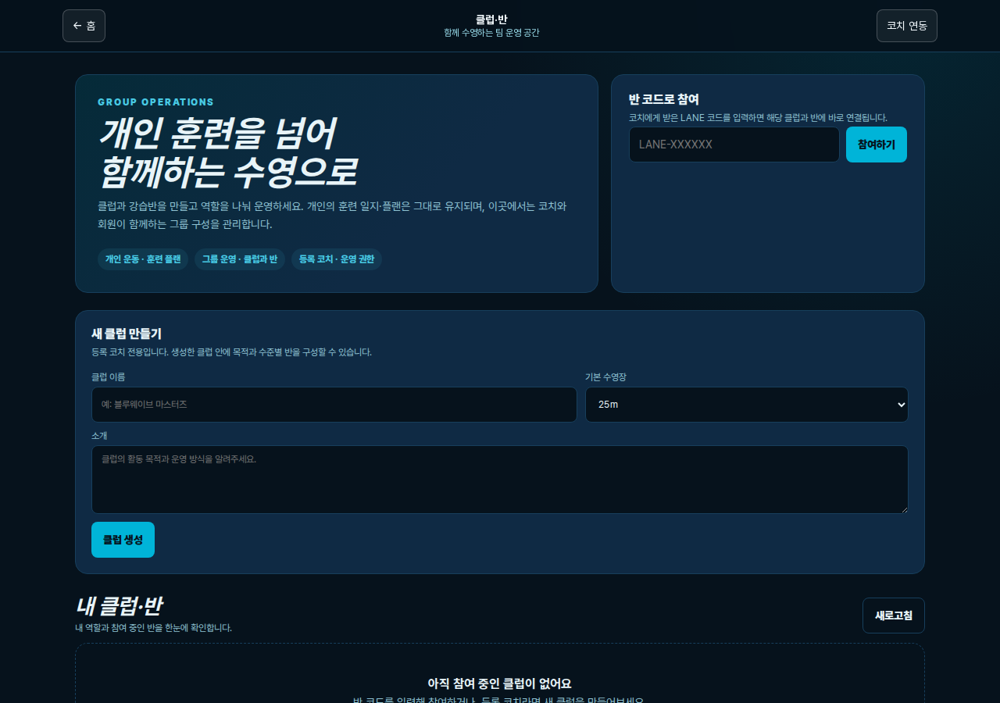
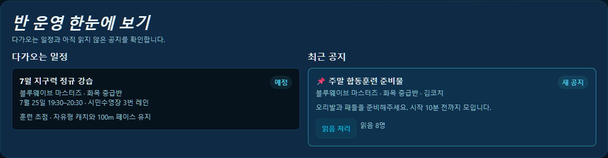
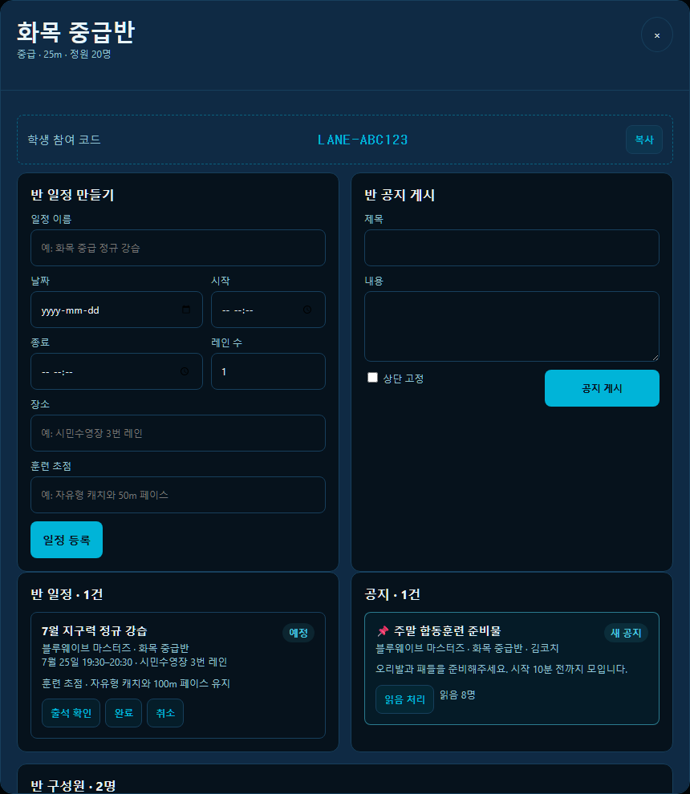

# 🏊 SwimMate — 수영 훈련을 기록하고 설계하는 올인원 도우미

> 개인 수영인의 훈련 준비·플랜·일지·리포트부터 코치의 강습 운영까지 하나의 흐름으로 연결한 웹 서비스입니다.

[웹서비스 바로가기](https://swimtech.vercel.app) · [기능 지도](./docs/FEATURE_MAP.md) · [기술 구조](./docs/ARCHITECTURE.md) · [배포 가이드](./docs/DEPLOYMENT.md) · [기능 체크리스트](./FEATURE_CHECKLIST.md) · [품질 검증 게이트](./docs/QUALITY_GATE.md)

> 저장소와 배포 URL에는 초기 프로젝트명인 `swimtech`가 남아 있지만, 사용자에게 표시되는 서비스명은 **SwimMate**입니다.

## 서비스 이용

SwimMate는 별도의 프로그램이나 설치 마법사가 필요 없는 웹서비스입니다. PC와 모바일 브라우저에서 [swimtech.vercel.app](https://swimtech.vercel.app)에 접속하면 바로 이용할 수 있습니다.

- 계정이 있다면 로그인 후 개인 기록과 코치 연동 기능을 이용할 수 있습니다.
- 처음 방문했다면 로그인 화면의 **비회원 체험 시작**에서 샘플 훈련 플랜·일지·리포트 흐름을 확인할 수 있습니다.
- 지원 브라우저에서는 선택적으로 홈 화면에 추가할 수 있지만, PWA 설치는 필수가 아닙니다.

---

## 프로젝트 개요

| 항목 | 내용 |
| --- | --- |
| 해결하려는 문제 | 훈련 기록, 플랜 작성, 성장 확인, 수영 정보와 코치 피드백이 여러 서비스에 흩어진 문제 |
| 현재 방향 | 영상 분석 중심이 아닌 **수영 훈련 도우미와 코치 강습 운영 플랫폼** |
| 주요 사용자 | 개인 수영인, 수강생과 코치, 포트폴리오를 살펴보는 비회원 방문자, 서비스 운영자 |
| 개발 범위 | 기획, UX, 프론트엔드, API, 데이터 모델, 배포, 운영 QA |
| 개발 기간 | 2026.05 ~ 진행 중 |
| 공개 배포 | Vercel 프론트엔드 + Render FastAPI + Neon PostgreSQL |
| 품질 기준 | 기능 추가 시 API/UI QA 매핑, 회귀 테스트, 문서·릴리즈 노트를 함께 갱신 |

## 문제 정의

수영을 꾸준히 하려면 단순히 기록만 저장하는 것으로는 부족합니다.

- 오늘 몸 상태에 맞춰 어느 강도로 훈련할지 판단하기 어렵습니다.
- 목적과 수영장 길이에 맞는 세트, 거리, 사이클을 직접 설계하기 어렵습니다.
- 훈련 일지와 월간 리포트가 분리되면 기록이 실제 성장 확인으로 이어지지 않습니다.
- 코치는 개인 운동과 별개로 여러 회원에게 배포할 강습표와 일정표를 반복해서 작성해야 합니다.
- 처음 방문한 사람은 회원가입 전에는 서비스의 실제 흐름을 파악하기 어렵습니다.

SwimMate는 이를 `준비도 확인 → 훈련 선택 → 일지 기록 → 성장 리포트 → 다음 훈련 추천`의 연속된 흐름으로 풀고 있습니다.

---

## 핵심 기능

### 1. 개인 훈련 관리

- **맞춤 훈련 설정**
  - 로그인 후 대표 홈인 `/landing`에서 현재 수준, 주요 목표, 주당 훈련 횟수, 주로 이용하는 25m/50m 풀 설정 안내를 확인합니다.
  - 저장한 기준은 서버 계정에 유지되며 대시보드 추천 거리·세션 내용과 훈련 플랜 생성 기본값에 함께 반영됩니다.
  - 프로필에서 현재 설정을 한눈에 확인하고 `/onboarding?mode=edit` 화면에서 언제든 수정할 수 있습니다.





- **계정과 개인 데이터 관리**
  - 프로필에서 현재 비밀번호를 확인한 뒤 비밀번호를 변경하고 다른 기기의 기존 세션을 함께 종료할 수 있습니다.
  - 프로필·개인화·일지·세트·테스트 기록·PB·플랜·뱃지·챌린지 등 본인 데이터를 백업·이동 가능한 JSON 파일로 내보냅니다.
  - `/my-data`에서는 JSON을 직접 가공하지 않아도 평생 누적, 최근 90일 변화, 12개월 추이, 영법·수영장 분포, 기록 습관, 코스별 PB와 다음 행동 제안을 한눈에 확인합니다.
  - 모든 기기 로그아웃과 비밀번호 재확인 회원 탈퇴를 제공하며, 세션 버전을 확인해 변경 전 액세스·갱신 토큰을 거부합니다.



- **훈련 대시보드**
  - 주간 목표, 누적 거리, 최근 훈련, 연속 출석을 한눈에 확인합니다.
  - 수면·피로·근육 상태·가용 시간을 입력하면 당일 준비도 점수와 상태를 계산합니다.
  - 최근 기록과 준비도뿐 아니라 온보딩에서 정한 수준·목표·선호 풀을 반영한 규칙 기반 주간 훈련 어드바이저를 제공합니다.
- **훈련 플랜**
  - 기록 단축, 건강 유지, 영법 교정, 취미, 다이어트, 마스터즈 등 목적별 플랜을 제공합니다.
  - 25m/50m 수영장, 초급/중급/상급 사이클, 드릴/대시 구성과 세부 세트별 출발 사이클을 선택할 수 있습니다.
  - 랜덤 생성, 직접 구성, 템플릿 저장·복제, 즐겨찾기·공유, 모바일 버튼 정렬을 지원합니다.
  - 거리·강도·휴식·사이클·웜업/메인/쿨다운 비율을 저장 전에 점검합니다.
- **훈련 일지와 파일 기반 운동 데이터 가져오기**
  - 영법, 거리, 시간, 강도, 기분, 메모와 수영장 길이를 기록합니다.
  - 플랜의 웜업·드릴·메인·쿨다운은 반복 횟수, 세트 거리, 목표 사이클과 실제 수행량을 구조화된 세트 데이터로 함께 저장합니다.
  - 일지 목록에서 세트 완료 수와 거리 기반 수행률을 확인하고, 세트 수행량을 갱신하면 총거리 통계와 리포트에도 반영됩니다.
  - 월간 목표, 캘린더, 총 거리, 평균 거리, 연속 출석을 함께 보여줍니다.
  - Health Auto Export JSON, Apple 건강 내보내기 ZIP, Samsung Health CSV/ZIP을 미리 확인한 뒤 선택한 수영 기록만 일지로 가져옵니다.
  - Apple Watch나 Galaxy Watch와 실시간으로 동기화하는 기능은 아닙니다. 사용자가 건강 앱에서 내보낸 파일을 직접 올리는 방식입니다.
- **풀사이드 훈련 실행**
  - 세트가 있는 일지에서 큰 글씨의 현재·다음 세트와 거리 진행률을 보며 훈련합니다.
  - 출발 사이클 카운트다운 또는 자유 스톱워치, 반복 완료, 건너뛰기, 화면 켜짐 유지와 터치 중심 조작을 제공합니다.
  - 실제 반복·거리·평균 사이클·RPE·상태·메모를 세트마다 저장하고 일지 총거리와 월간 리포트에 즉시 연결합니다.



- **테스트 세트와 개인 최고기록(PB)**
  - 자유형·배영·평영·접영의 표준 거리 기록을 0.01초 단위로 저장하고, 이전 최고기록과 단축 시간을 즉시 확인합니다.
  - 25m와 50m 수영장은 같은 영법·거리라도 별도 코스로 집계해 서로 다른 퍼포먼스를 섞지 않습니다.
  - 선택한 훈련 일지와 테스트 기록을 연결할 수 있고, 월간 시도 횟수·신규 PB와 전체 현재 최고기록을 훈련 일지와 리포트에서 함께 보여줍니다.



- **월간 성장 리포트**
  - 훈련 일지를 기준으로 총 거리, 횟수, 평균 거리, 시간, 추정 칼로리를 집계합니다.
  - 영법별 거리, 주차별 추이, 훈련 빈도, 전월 대비 성장률과 최장 연속 출석을 시각화합니다.
  - 플랜 완료 세션, 플랜 기반 수행 거리, 사이클 기록 포함률과 월간 목표 달성률을 연결해 보여줍니다.
  - 구조화된 세트가 있는 기록은 완료 세트 수와 계획 대비 수행 거리를 계산해 세트 수행률로 표시합니다.
  - 해당 월의 테스트 시도와 신규 PB, 영법·거리·코스별 현재 최고기록을 함께 표시합니다.



### 2. 코치와 수강생 연동

- 코치는 프로필 등록 즉시 `SWIM-XXXX` 형식의 코치 코드를 발급받아 복사하거나 공유할 수 있습니다.
- 학생이 코드를 직접 입력한 경우에만 코치가 해당 학생의 일지 열람, 피드백 작성과 개인 플랜 전달을 할 수 있습니다.
- 학생은 새 코치 코드로 관계를 교체하거나 직접 연동을 해제할 수 있습니다.
- 자격 정보 제출은 기능을 막는 필수 승인 절차가 아니라 선택 인증이며, 완료 시 학생에게 `본인 확인 코치` 배지가 표시됩니다.
- 코치는 연동 학생의 최근 기록을 확인하고 피드백·개별 플랜을 전달하며, 자유수영 공유와 전체 수강생 대상 강습 일지도 운영할 수 있습니다.

#### 클럽·반 그룹 운영

- 등록 코치는 클럽을 만들고 수준, 목표, 25m/50m 풀, 정원을 지정해 여러 반을 구성합니다.
- 학생은 코치에게 받은 `LANE-XXXXXX` 반 코드를 직접 입력해 클럽과 해당 반에 동시에 참여합니다.
- 클럽의 소유자·코치·보조 코치·회원과 반의 코치·보조 코치·학생 역할을 분리합니다. 코치·보조 코치 권한은 SwimMate에 등록된 코치에게만 부여할 수 있습니다.
- 반 코치 권한은 해당 반에만 적용되며, 담당 코치를 학생으로 바꾸거나 담당 반을 둔 채 클럽에서 나가는 데이터 불일치를 차단합니다.
- 클럽 운영자와 해당 반 코치는 날짜·시간·장소·레인·훈련 초점을 포함한 일정을 등록하고 완료·취소 상태를 관리합니다.
- 반 학생의 출석·지각·결석·사유 결석과 메모를 기록하며, 학생 계정은 본인 출석만 확인할 수 있습니다.
- 클럽 전체 또는 특정 반 공지를 게시해 대상 회원에게 알림을 보내고 사용자별 읽음 상태를 관리합니다.
- 코치는 최근 7~180일의 반 일정, 확인된 출석률, 출석 기록 완료율과 주간 추이를 한 화면에서 확인합니다.
- 학생별 연속 결석·낮은 출석·반복 지각 신호를 구분하며, 개인 훈련량은 해당 학생이 별도로 코치 코드를 연동한 경우에만 표시합니다.







#### 코치용 AI 강습 운영

- 대상 반, 수준, 목표, 풀 길이, 수업 시간, 기간, 주당 횟수, 장비와 레인 제약을 입력해 단체 훈련표 또는 강의 일정표를 만듭니다.
- 생성 결과를 코치가 직접 검토·수정한 뒤 전체 또는 선택 학생에게 배포합니다.
- AI 호출이 지연되거나 사용 불가능해도 구조화된 규칙 템플릿으로 업무를 이어갈 수 있습니다.
- 반 편성·회복 관찰·다음 수업 초점 브리핑에는 학생 실명 대신 `S1`, `S2` 익명 참조를 사용합니다.

#### Jira 기반 크루 훈련 운영판

- 코치 화면에서 연동 회원의 최근 30일 훈련 횟수, 누적 거리, 마지막 훈련일, 준비도 신호를 한 번에 확인합니다.
- 코칭 과제를 만들면 SwimMate DB에 먼저 저장하고 Jira 업무로 동기화해 처리 흐름을 이어갑니다.
- Jira 분석 그래프는 코치가 만든 과제 키를 기준으로 과제 유형, 주간 생성·완료 흐름, 상태별 분포, 7일 이상 멈춘 과제를 보여줍니다.
- Jira 상태 변경 웹훅과 SwimMate 완료 버튼을 통해 양방향 완료 동기화를 지원합니다.
- 코치 화면에서 Jira 목록, 보드, 캘린더, 타임라인을 바로 열어 팀 운영 상황을 공유할 수 있습니다.
- 무료 티어 부담을 줄이기 위해 Jira 분석은 최대 100개 과제를 한 번에 검색하고 최대 60초 동안 서버 캐시를 사용합니다.

### 3. 동기부여와 커뮤니티

- **단계형 뱃지** — 거리, 기록 횟수, 연속 출석, 영법, 수영장 길이, 플랜 실천과 월간 목표별 다음 단계를 안내합니다.
- **수영 챌린지** — 거리·연속 출석 챌린지와 실시간 진행률·랭킹을 훈련 일지에 연결합니다.
- **커뮤니티** — 게시글, 댓글, 좋아요, 북마크, 태그, 멘션, 신고, 이미지와 마크다운 미리보기를 지원합니다.
- **알림** — 커뮤니티 반응과 코치의 플랜·강습 일정·강습표 배포를 사용자에게 전달합니다.

### 4. 수영 정보와 도움

- Gemini 기반 AI 코치 대화
- 카카오맵 기반 주변 수영장 검색과 즐겨찾기
- 영법별 드릴 가이드와 영상 큐레이션
- 부상 예방, 장비 가이드, 수영 용어 사전, FAQ
- Google·카카오 소셜 로그인과 프로필 관리

### 5. 포트폴리오 데모와 운영 도구

- **비회원 체험** — 로그인 화면에서 별도 가입 없이 샘플 훈련 일지, 플랜, 리포트와 뱃지를 확인할 수 있습니다.
- **PWA 설치** — 지원 브라우저에서는 홈 화면 설치 안내를 제공하며, 정적 자산과 기본 진입 화면을 네트워크 우선 방식으로 캐시합니다.
- **슈퍼 관리자** — 사용자, 페이지 조회·운영 로그, 피드백 작성자, 훈련 운영 상태, 준비도, 클럽·반·일정·출석률·공지, 코치 등록·선택 인증과 AI 강습 배포 현황을 조회합니다.
- 모든 주요 관리자 목록은 20/50/100개 표시와 번호 기반 페이지 이동을 지원합니다.

---

## AI 기능의 현재 범위

현재 공개 서비스에서 AI는 다음 두 영역에 사용됩니다.

1. 수영 질문에 답하는 **AI 코치 대화**
2. 등록 코치의 **단체 강습표·일정표 및 익명 수업 브리핑 생성**

훈련 준비도와 주간 추천은 생성형 AI가 아니라 사용자의 최근 기록과 회복 상태를 설명 가능한 규칙으로 계산합니다. 외부 AI가 응답하지 않아도 코치 강습 운영이 중단되지 않도록 템플릿 폴백을 제공합니다.

훈련 플랜의 `교정 포인트 추천`은 영상 분석 API 연동 기능이 아닙니다. 사용자가 캐치·호흡·킥·자세 같은 고민을 직접 선택하면 저장된 드릴 세트 규칙으로 플랜을 구성합니다.

### 영상 영법 분석 — 개선 중 · 공개 서비스 비활성

영상 업로드 기반 영법 분석은 현재 구현 완료 기능으로 소개하지 않습니다.

- 공개 FastAPI 앱에는 영상 업로드·분석 라우터를 등록하지 않았습니다.
- 기존 `/meta`, `/upload`, `/viewer`, `/share/*` 주소는 홈으로 이동하거나 `410 Gone`을 반환합니다.
- Render 배포 의존성에서 MediaPipe와 OpenCV를 제외해 무거운 컴퓨터 비전 파이프라인이 실행되지 않도록 했습니다.
- 저장소의 `analysis/`와 일부 레거시 모듈은 초기 실험 기록으로 남아 있지만 현재 제품 경로와 분리되어 있습니다.
- 과거 README에 있던 분석 정확도 수치는 현재 공개 배포에서 재현·검증하는 지표가 아니므로 제거했습니다.

다시 공개하려면 대표성 있는 평가 데이터셋, 영법별 품질 기준, 영상 보관·삭제 정책, 별도 비동기 분석 인프라와 배포 환경 E2E 검증을 먼저 갖출 계획입니다.

---

## 서비스 구조

```text
사용자 브라우저
    │
    ├─ 정적 화면 ───────────────▶ Vercel
    │                              │
    └─ /api, /auth 요청 ──────────┘
                                   ▼
                           Render · FastAPI
                                   │
                    ┌──────────────┼──────────────┐
                    ▼              ▼              ▼
            Neon PostgreSQL   Google Gemini   외부 연동
                                                ├─ Google/Kakao OAuth
                                                ├─ Kakao Maps
                                                ├─ Jira Cloud
                                                └─ Notion 변경 이력
```

- Vercel rewrite로 동일 출처의 `/api/*`, `/auth/*` 요청을 Render 백엔드에 전달합니다.
- GitHub Actions가 백엔드 변경 시 Render 배포 훅을 호출하고 상태 확인 작업을 수행합니다.

## 기술 스택

| 영역 | 기술 |
| --- | --- |
| Frontend | HTML, CSS, Vanilla JavaScript, Chart.js, Kakao Maps SDK |
| Backend | FastAPI, Pydantic, psycopg2, JWT 쿠키 인증, SlowAPI |
| Database | PostgreSQL · Neon · Alembic |
| AI | Google Gemini, 구조화 출력, 규칙 기반 폴백 |
| Infra | Vercel, Render, GitHub Actions |
| Collaboration/Ops | Jira Cloud REST API·Webhook, Notion 변경 이력 |
| Quality | pytest, Playwright, API 시나리오 QA, UI 크롤러 |

## 처음 보는 사람을 위한 기술 스택 설명

SwimMate는 “화면을 보여주는 곳”, “데이터를 처리하는 서버”, “기록을 저장하는 데이터베이스”를 나누어 둔 구조입니다. 사용자가 보는 화면은 Vercel이 빠르게 내려주고, 버튼을 눌러 기록 저장·로그인·AI 대화 같은 작업을 할 때는 Render의 FastAPI 서버가 처리한 뒤 Neon PostgreSQL에 저장합니다.

| 기술 | 쉽게 말하면 | SwimMate에서 하는 일 |
| --- | --- | --- |
| HTML/CSS/Vanilla JavaScript | 웹 화면을 직접 구성하는 기본 재료 | 대시보드, 훈련 플랜, 일지, 리포트, 코치 화면의 UI와 상호작용 |
| Chart.js | 숫자를 그래프로 보여주는 도구 | 월간 성장 리포트, Jira 분석, 거리·빈도 추이 시각화 |
| Kakao Maps SDK | 카카오 지도 기능을 웹에 붙이는 도구 | 주변 수영장 검색과 지도 표시 |
| Vercel | 정적 웹사이트를 배포하는 서비스 | 사용자가 접속하는 프론트엔드 화면 제공, `/api/*` 요청을 백엔드로 전달 |
| FastAPI | Python으로 API 서버를 만드는 프레임워크 | 로그인, 훈련 기록, 코치 연동, 커뮤니티, 관리자 API 처리 |
| Pydantic | 서버로 들어오는 데이터의 형식을 검사하는 도구 | 잘못된 요청을 막고 AI가 만든 JSON 결과도 구조화해 검증 |
| Neon PostgreSQL | 클라우드 PostgreSQL 데이터베이스 | 회원, 훈련 일지, 플랜, 리포트, 코치-학생 관계, 커뮤니티 데이터 저장 |
| Alembic | 데이터베이스 변경 이력을 순서대로 적용하는 도구 | Render와 FastAPI 시작 전에 승인된 스키마 리비전을 적용하고 health에서 버전을 확인 |
| psycopg2 | Python 서버가 PostgreSQL과 대화하는 연결 도구 | FastAPI 라우터에서 SQL을 실행 |
| JWT HttpOnly Cookie | 로그인 상태를 안전하게 유지하는 방식 | 사용자가 새로고침해도 로그인 상태를 유지하고 JavaScript 직접 접근을 줄임 |
| SlowAPI | 요청을 너무 많이 보내는 사용자를 제한하는 도구 | AI 채팅, 코치 AI 생성 등 비용이 생길 수 있는 API 호출 보호 |
| Google Gemini | 생성형 AI 모델 | 수영 질문 답변, 코치용 단체 강습안·브리핑 생성 |
| Jira Cloud API | 외부 업무 관리 서비스와 연결하는 API | 코치가 만든 후속 과제를 Jira 업무로 동기화하고 상태를 다시 받아옴 |
| Notion API | Notion 문서를 웹 서비스와 연결하는 API | 공개 릴리즈 노트 `/changelog` 연동 |
| GitHub Actions | 저장소 변경 후 자동 작업을 실행하는 도구 | 백엔드 변경 시 Render 배포 훅 호출과 health check |
| pytest / Playwright | 코드와 화면을 자동으로 검사하는 도구 | API 계약, 주요 사용자 흐름, 화면 오류를 회귀 테스트 |

핵심은 AI가 모든 판단을 대신하는 서비스가 아니라는 점입니다. 훈련 준비도, 주간 추천, 리포트 계산은 설명 가능한 규칙과 DB 집계로 처리하고, Gemini는 질문 답변과 코치 문서 초안처럼 “문장을 만들어야 하는 곳”에만 씁니다.

## 무료 티어 운영 범위

아래 내용은 2026-07-20에 각 서비스의 공식 안내를 다시 확인한 운영 참고값입니다. 요금제와 쿼터는 바뀔 수 있으므로 실제 배포 전에는 링크된 공식 페이지와 각 콘솔의 현재 사용량을 다시 확인해야 합니다.

| 서비스 | 현재 역할 | 무료 범위 판단 |
| --- | --- | --- |
| Vercel Hobby | 프론트엔드 정적 화면과 API rewrite | [Hobby 약관](https://vercel.com/legal/terms)상 개인·비상업 용도입니다. 상업 운영 전에는 Pro 등 적합한 요금제를 검토해야 합니다. |
| Render Free Web Service | FastAPI 백엔드 | [공식 무료 안내](https://render.com/docs/free) 기준 15분 동안 인바운드 트래픽이 없으면 중지되고, 워크스페이스당 월 750시간을 공유합니다. 로컬 파일은 영속 저장소로 사용하면 안 됩니다. |
| Neon Free | PostgreSQL 운영 DB | [공식 가격표](https://neon.com/pricing)의 프로젝트별 저장소·CU-hour 한도를 기준으로 운영합니다. 사용량은 Neon 콘솔에서 확인합니다. |
| Gemini API | AI 코치 대화와 코치 문서 생성 | 앱 자체 제한은 채팅 10회/분, 코치 문서·브리핑 각각 6회/시간입니다. 모델·프로젝트별 실제 RPM/TPM/RPD는 [AI Studio의 활성 한도](https://ai.google.dev/gemini-api/docs/rate-limits)를 따릅니다. |
| Jira Free | 코치 운영 과제판 | [Jira 가격표](https://www.atlassian.com/software/jira/jira/pricing) 기준 최대 10명의 Jira 사용자와 2GB 저장소를 제공합니다. 일반 수영 회원을 Jira 사용자로 만들지 않는 구조입니다. |
| Kakao Maps / Google OAuth / Kakao OAuth | 지도와 로그인 | 무료 여부와 쿼터는 각 콘솔에서 앱별 사용량 확인 필요 |
| Notion API | 릴리즈 노트 | 작은 문서 동기화에는 적합. 공개 화면은 실패 시 서비스 핵심 기능과 분리 |

무료 운영을 오래 유지하려면 AI 호출을 사용자 수에 그대로 비례시키지 않고, 코치 문서 생성과 채팅에 전역 일일 예산을 추가하는 것이 다음 단계입니다. Render 백엔드는 cold start가 있으므로 공개 체험이 많아질 경우 Vercel/Cloudflare 계열로 통합하거나 Render 유료 인스턴스로 전환하는 선택지가 있습니다.

---

## 테스트와 QA

핵심 자동 테스트와 실제 배포 서비스 검사를 하나의 GitHub Actions 품질 게이트로 관리합니다.

- 단위·계약·Jira 통합 테스트 93개
- `main` Push·PR에서는 핵심 테스트를 실행합니다.
- 매일 09:00 KST 및 수동 실행에서는 핵심 테스트에 이어 운영 API와 Chromium UI 검사를 일괄 실행합니다.
- `scripts/qa_runner.py` — 인증·대표 홈 리다이렉트·개인 데이터 내보내기·장기 인사이트·계정 보안, 훈련 기록·테스트 세트·코스별 PB·리포트, 코치 코드, 클럽·반 역할·일정·출석·공지·수행 분석, 관리자 API 등 운영 시나리오 49개를 실제 사용자 흐름으로 점검
- `scripts/qa_ui_crawler.py` — 로그인 목적지, 홈 링크, 온보딩 수정·계산 스타일, 개인 데이터의 기록 있음·빈 상태를 포함한 역할별 주요 27개 페이지의 DOM·콘솔 오류·실패 API와 관리자 화면 매핑을 점검
- `docs/QUALITY_GATE.md` — 기능 유형별로 반드시 넘어가야 할 검증 기준과 증적 산출물을 정리

`tests/test_swimtech.py`의 Playwright 104개 정의는 과거 로컬 통합 환경용 참고 시나리오로 남겨 두었으며 현재 필수 품질 게이트의 통과 수에는 포함하지 않습니다. 배포 검증 증적은 실행마다 생성되는 핵심 HTML·JUnit 리포트, `qa_report.json`, `qa_ui_report.json`, UI 스크린샷으로 판정합니다.

기능을 추가할 때는 코드만 수정하지 않고 체크리스트, API/UI QA, 계약 테스트와 품질 게이트 문서를 함께 갱신합니다. 특히 준비도, 헬스 데이터 가져오기, 플랜 품질 검증, 월간 리포트, 챌린지·뱃지, 커뮤니티·알림, 코치 AI, Jira, 관리자 지표는 서로 다른 화면과 데이터가 이어지므로 단순 200 응답보다 실제 데이터 반영과 권한 경계까지 확인합니다.

로그인 검사는 코드에 계정을 저장하지 않고 GitHub Actions Secrets의 일반·학생·관리자 전용 QA 계정으로 수행합니다. 필수 계정이 누락되면 해당 검사를 생략하지 않고 전체 품질 게이트가 실패합니다. 구체적인 판정 기준은 [품질 검증 게이트](./docs/QUALITY_GATE.md)에서 관리합니다.

최근 운영 검증은 GitHub Actions `30073137555`에서 핵심 93/93, 운영 API 49/49, 일반·코치·학생·관리자 브라우저 27/27을 통과했습니다.

## 디렉터리 구성

```text
api/                    FastAPI 애플리케이션과 도메인별 라우터
frontend/               페이지별 HTML·CSS·Vanilla JavaScript
docs/                   기능 지도, 아키텍처, 배포, 품질 문서
scripts/                API QA와 UI 크롤러
tests/                  단위·계약·Playwright E2E 테스트
db/                     PostgreSQL 스키마와 초기 데이터 스크립트
analysis/               현재 제품과 분리된 영상 분석 실험 코드
FEATURE_CHECKLIST.md    기능 우선순위와 완료 기준
frontend/vercel.json    프론트엔드 리다이렉트와 API rewrite
render.yaml             FastAPI 배포 설정
```

---

## 주요 설계 판단

- **훈련 일지를 단일 기준 데이터로 사용**해 대시보드, 챌린지, 뱃지와 월간 리포트의 수치가 따로 놀지 않게 했습니다.
- **운영 기능은 실패에 강하게 설계**해 배포 환경에 선택 테이블이나 외부 AI가 없어도 가능한 범위에서 0값·템플릿 폴백을 제공합니다.
- **코치 기능은 승인 대기보다 사용자 통제에 집중**해 등록 즉시 코드를 발급하고, 학생이 관계 생성·교체·해제를 직접 결정합니다.
- **개인정보 노출을 줄이기 위해** AI 수업 브리핑에는 학생 이름 대신 익명 참조를 전달합니다.
- **기능과 QA를 함께 변경**하는 계약 테스트로 새 화면이나 API만 추가되고 검증이 빠지는 상황을 방지합니다.

## 개발 방식

개인 프로젝트로 요구사항 정의, 우선순위 결정, 데이터 흐름과 배포 구조 설계, 구현 검토와 회귀 검증을 직접 수행했습니다. 생성형 AI 도구는 반복 구현과 탐색 속도를 높이는 데 활용했지만, 기능 범위 결정과 실제 동작 검증은 테스트와 운영 로그를 기준으로 판단했습니다.
